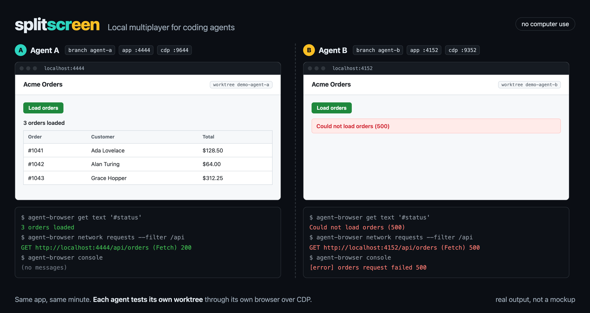

<h1 align="center">splitscreen</h1>

<p align="center">
  <b>Local multiplayer for coding agents.</b><br>
  Every agent tests its own copy of your web or Electron app: its own worktree, its own ports, its own browser, attached over CDP.<br>
  No computer use. No agents clicking in each other's windows.
</p>

<p align="center">
  <a href="https://skills.sh/niharnm/splitscreen"></a>
  <a href="https://github.com/niharnm/splitscreen/actions/workflows/test.yml"></a>
  <a href="LICENSE"></a>
</p>

```bash
npx skills add niharnm/splitscreen -g
```

Works with Claude Code, Codex, Cursor, Gemini CLI, GitHub Copilot, OpenCode, and 70+ other agents through the [skills CLI](https://github.com/vercel-labs/skills).



*Real output from two agents on two worktrees of one app. Agent B's branch has a bug; agent A's does not. Each agent was attached only to its own app.*

## The problem

Run three agents in three worktrees and they all break at the same step: testing.

- **They share one screen.** Computer use drives one mouse on one desktop, so parallel agents click in each other's windows.
- **They test the wrong build.** Every worktree's dev server wants port 3000, and the agent checks whichever one answered.
- **They see pixels, not causes.** A screenshot shows the red banner. It does not show the 500 or the console error behind it.

## The fix

Each agent claims a **screen**:

| A screen has | For example |
| --- | --- |
| A Git worktree | `../app-fix-login` on branch `fix-login` |
| An app port for its own dev server | `4444` |
| A CDP port for its own Chrome or Electron instance | `9644` |
| An [agent-browser](https://github.com/vercel-labs/agent-browser) session attached to that port | `screen-fix-login-367661` |

The same worktree always gets the same ports. Two worktrees never share them, and a port held by anything else is never taken. The agent drives its own browser through the Chrome DevTools Protocol, so it reads the DOM, the accessibility tree, console messages, page errors, and every network request.

| | Computer use | One shared browser | splitscreen |
| --- | --- | --- | --- |
| What the agent reads | Screenshots | The DOM of whatever tab is open | DOM, accessibility tree, console, page errors, network |
| Parallel agents | Share one mouse and screen | Navigate each other's tabs | Separate worktree, ports, and browser each |
| Which build it tests | Whatever is on screen | Whatever answers on :3000 | Its own worktree's server, checked by process group |
| Where it runs | A desktop session | Anywhere | macOS, Linux, a VPS, or CI, with headless Chrome |
| Cleanup | By hand | By hand | `stop` ends only what that screen started |

## Quick start

Install the skill and the CDP client it drives:

```bash
npx skills add niharnm/splitscreen -g
npm install -g agent-browser
```

You also need Python 3.9 or newer, Chrome or Chromium, and `lsof` (or `ss` on Linux), on macOS or Linux.

Then ask your agent:

```text
Use splitscreen to test the checkout flow in this worktree. Report console errors and failed requests.
```

Under the hood it runs:

```bash
set -e
screen="$(python3 <skill-dir>/scripts/splitscreen.py env)" && eval "$screen"
python3 <skill-dir>/scripts/splitscreen.py serve --cmd 'pnpm dev'   # started with PORT=$APP_PORT
python3 <skill-dir>/scripts/splitscreen.py chrome                   # dedicated Chrome on $CDP_PORT
agent-browser connect "$CDP_PORT" && agent-browser open "$APP_URL"
agent-browser snapshot -i
agent-browser console && agent-browser errors && agent-browser network requests
python3 <skill-dir>/scripts/splitscreen.py stop
```

`serve` sets `PORT=$APP_PORT`, which Next.js and many servers read. Frameworks that ignore it need their own flag, such as `vite --port "$APP_PORT" --strictPort`. If the server comes up on any other port, `serve` fails instead of letting the agent test the wrong app.

### Claude Code plugin

```text
/plugin marketplace add niharnm/splitscreen
/plugin install splitscreen@splitscreen
```

## Electron

Electron apps are Chromium, so each running copy can expose its own CDP port. Add this to your main process, before `app.whenReady()` and any single-instance lock. The `app.isPackaged` check keeps this code from opening a debugging port in shipped builds.

```js
const fs = require('node:fs');
const { app } = require('electron');

if (!app.isPackaged && process.env.CDP_PORT) {
  app.commandLine.appendSwitch('remote-debugging-port', process.env.CDP_PORT);
}
if (!app.isPackaged && process.env.ELECTRON_USER_DATA_DIR) {
  fs.mkdirSync(process.env.ELECTRON_USER_DATA_DIR, { recursive: true });
  app.setPath('userData', process.env.ELECTRON_USER_DATA_DIR);
}
```

Then make each copy load its own renderer: start the renderer dev server on `$APP_PORT` and, in development, load `process.env.APP_URL` instead of a hardcoded `http://localhost:5173`. Now every agent can run its own dev build of the same app at once:

```bash
python3 <skill-dir>/scripts/splitscreen.py serve --wait cdp --cmd 'npm run dev'
agent-browser connect "$CDP_PORT"
agent-browser tab       # windows and webviews are separate targets
agent-browser get url   # confirm it shows this worktree's renderer
```

## Commands

| Command | What it does |
| --- | --- |
| `env` | Claims this worktree's screen and prints `APP_PORT`, `CDP_PORT`, `APP_URL`, `AGENT_BROWSER_SESSION`, and more. `--json` for JSON, `--move` to take a new slot |
| `serve --cmd '...'` | Starts your dev server in the background and waits until this screen owns the port. `--wait cdp` for Electron, `--wait none` to skip the wait, `--timeout`, `--restart` |
| `chrome` | Starts a dedicated headless Chrome on the screen's CDP port. `--headed` to watch, `--timeout` |
| `status` | Shows ports, listeners, processes, and log paths |
| `stop` | Closes the browser session and stops what this screen started. `--force` for leftovers it cannot verify, `--release` to free the ports and delete the screen's profiles, logs, and saved files |
| `list` | Shows every screen in the state directory. `--prune` drops deleted worktrees |

Every command takes `--root <worktree>`, and `--help` lists all flags.

## Safety

- **It only stops what it started.** Each process is tracked by PID, start time, and process group. If ownership cannot be proven, `stop` lists the processes and signals nothing.
- **It never takes a busy port.** Ports held by other processes are refused. After start, every socket on the screen's port, IPv4 and IPv6, must belong to the screen's own processes, checked with `lsof` or `ss`. Without either tool, `serve` refuses to start.
- **Throwaway profiles.** The dedicated Chrome always gets its own profile. Electron apps get one when they honor `ELECTRON_USER_DATA_DIR`, as in the snippet above.
- **Localhost only.** Chrome and Electron bind the debugging port to localhost, where any local process can reach it. Stop screens when you are done.

## Tested

- CI runs the test suite on macOS and Linux with Python 3.9 and 3.13.
- Two agents on two worktrees of one app at the same time, as in the image above.
- Two VS Code (Electron) instances at once, each on its own CDP port and profile.
- Two worktrees of a private Next.js 16 pnpm monorepo, served and tested in parallel.

## FAQ

**Do I need an Electron app?**
No. Web apps get a dedicated headless Chrome per screen. Electron is just where computer use hurts most.

**Why agent-browser instead of Playwright MCP or Chrome DevTools MCP?**
Its snapshots with element refs are compact and built for agents. Any CDP client can attach to a screen's `CDP_PORT`, so use the one you like.

**Does it work on a VPS or in CI?**
Yes for web apps: the dedicated Chrome runs headless on Linux. Point `AGENT_BROWSER_EXECUTABLE_PATH` or `CHROME_PATH` at Chrome if it is not on `PATH`. Electron apps still need a display there, so run them under `xvfb-run` or similar.

**What about native macOS, iOS, or Windows apps?**
Not supported. CDP only reaches Chromium surfaces such as web pages and Electron. Native UI needs XCUITest or accessibility tooling.

**Where does state live?**
In `$SPLITSCREEN_HOME` if set, else `$XDG_STATE_HOME/splitscreen`, else `~/.local/state/splitscreen`. Move the port ranges with `SPLITSCREEN_APP_BASE`, `SPLITSCREEN_CDP_BASE`, and `SPLITSCREEN_SLOTS`; existing screens keep their ports until `env --move`.

## Credits

Built on [agent-browser](https://github.com/vercel-labs/agent-browser) by Vercel Labs.

If splitscreen stops your agents from fighting over the browser, a star helps other people find it.

[MIT](LICENSE)
